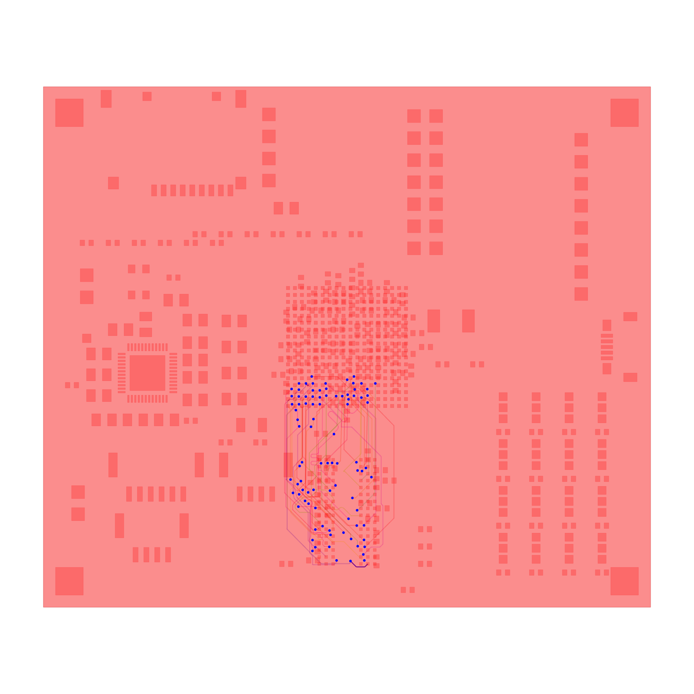

# AM3352 DDR_D0 retained-lead regression

This fixture originally reproduced `LengthMatchingNoSolutionError` in the AM3352 development board's byte-bus matching. The regression now requires successful matching while preserving endpoints, vias, and unrelated routes.

Run from the repository root:

```sh
bun install
RUN_AM3352_DDR_REPRO=1 bun test tests/repros/am3352-ddr-d0.test.ts --timeout 9999999
```

The test remains opt-in because the fixture is large. It checks successful completion, a maximum 0.635 mm length difference between DDR_D0 and DDR_D5, unchanged endpoints/vias/unrelated routes, and the final visualization. Normal `bun test` skips it.

## Provenance

- Board: https://tscircuit.com/seveibar/am3352-dev-board (published version 1.0.1).
- Placement: 70 × 60 mm, eight layers. Routing experiment used 0.1 mm signal width/clearance and 0.3/0.15 mm via pad/hole.
- Producer: `@tscircuit/capacity-autorouter@0.0.900`, `AutoroutingPipelineSolver9_PreloadedTraceGraph`, `{ effort: 1 }`.
- Length matcher commit bundled by the producer: `96cca6783a6e29d12bb1871185efe6ff2257bef8`, also the repository HEAD used to reproduce.
- The original SRJ contained 47 DDR connections, 908 obstacles, 15 preloaded clock/reference traces, three buses (11/11/24 members, 0.635 mm skew), and three differential pairs (0.127 mm skew, 0.12 mm gap). Non-DDR signal/power phases were not yet routed.
- The full producer run failed after 876.351 seconds in `lengthMatchingPostProcessingSolver`; that is full-pipeline time, not the isolated test runtime.

`input.json.gz` is the constructor input captured immediately before the producer's `busLengthMatchingSolver` first stepped, after differential-pair processing. It contains 48 high-density routes and 908 obstacles. The producer represents a bus as pairwise length comparisons to its longest member; the retained first comparison is `source_net_70` (`DDR_D0`) against `source_net_87` (`DDR_D5`), tolerance 0.635 mm. These are two byte-bus members, **not a physical differential pair**.

Only the subsequent comparison requests were removed (`differentialPairs.slice(0, 1)`). The solver fails on this first request, before those later requests run. All route geometry, obstacles, original connections, bounds, and layer/clearance settings are retained. This is a stage-isolated reproduction, not a geometrically minimized one.

The payload is gzip-compressed to avoid adding roughly 5 MB of largely repetitive obstacle connectivity metadata. Decompress for inspection:

```sh
gzip -dc fixtures/am3352-ddr-d0/input.json.gz > /tmp/am3352-ddr-d0.json
```

SHA-256 of decompressed UTF-8 JSON (including final newline):
`7849a1472a4903e38f9da40ce00590bbfdc55050befda898149dcfd315b7705c`.

The input has not been established to be globally DRC-clean or physically feasible. This PR records solver search behavior without implying that failure is necessarily incorrect. The fix preserves the clearance state of unchanged lead segments when checking a replacement that introduces new copper. New meander segments still undergo bounds, obstacle, via, and foreign-trace checks; this is not whole-board DRC signoff. Tolerances are unchanged.

## Verified replay

The original failure reproduced in 178.616 seconds / 59 iterations. With retained-lead validation corrected, the captured case passes in about 26 seconds / 62 iterations, including 199 assertions and snapshot verification. Runtime is informational.

## Final successful visualization

The test snapshots the final `solver.visualize()` after a successful solve. The SVG is in `tests/repros/__snapshots__/am3352-ddr-d0.snap.svg`; this PNG is rendered from that SVG. All layers are overlaid in the native view, including plane obstacles.


